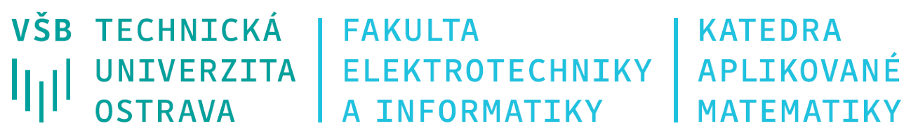

```{=latex}
\begin{center}
	\begin{tabular}{| p{.5\textwidth} | p{.5\textwidth}|}
		\hline
		Jméno studentky/studenta:      &   \\
		\hline
		Osobní číslo:                &   \\
		\hline
		Jméno cvičící/cvičícího: &   \\
		\hline
	\end{tabular}
\end{center}
```

```{=latex}
\begin{center}
	\begin{tabular}{|p{.33\textwidth}|p{.33\textwidth}|p{.33\textwidth}|}
		\hline
		                  & Datum odevzdání & Hodnocení \\
		\hline
		Domácí úkol 1: &                   &            \\
		\hline
		Domácí úkol 2: &                   &            \\
		\hline
		Domácí úkol 3: &                   &            \\
		\hline
		Domácí úkol 4: &                   &            \\
		\hline
		Celkem:           & -----             &            \\
		\hline
	\end{tabular}
\end{center}
```

```{=latex}
\begin{center}
	\textbf{Ostrava, AR 2021/2022}
\end{center}
````

# Popis dtového souboru

Běžné zářivky trpí efektem pomalého nabíhání, tedy plného výkonu dosáhnou až po jisté době provozu.  Toto chování je ovlivněno okolní teplotou, což v praxi znamená, že v chladném prostředí může zářivkám trvat výrazně déle než dosáhnou maximálního výkonu.

Pro test náběhu zářivek na plný světelný výkon bylo vybráno celkem 350 zářivek od čtyř různých výrobců (Amber, Bright, Clear, Dim). Všechny zářivky měly deklarovaný maximální světelný tok 1000 lm. U každé zářivky byl změřen světelný tok po 30 sekundách od zapnutí, nejprve při teplotě 22 °C a poté při teplotě 5°C.

V souboru `ukol_X.xlsx` jsou pro každou z testovaných zářivek uvedeny následující údaje:

* pořadové číslo zářivky,
* výrobce – Amber (A), Bright (B), Clear (C), Dim (D),
* naměřený světelný tok v lumenech při okolní teplotě 5°C,
* naměřený světelný tok v lumenech při okolní teplotě 22°C.

Obecné pokyny:

* Úkoly zpracujte dle obecně známých typografických pravidel.
* Všechny tabulky i obrázky musí být opatřeny titulkem.
* Do úkolů nevkládejte tabulky a obrázky, na něž se v doprovodném textu nebudete odkazovat.
* Bude-li to potřeba, citujte zdroje dle mezinárodně platné citační normy ČSN ISO 690.

# Úkol 1

> Pomocí nástrojů explorační analýzy porovnejte pokles světelného toku po 30 sekundách od zapnutí při snížení okolní teploty z 22°C na 5°C u zářivek od výrobců Amber a Bright. Data vhodně graficky prezentujte (krabicový graf, histogram, q-q graf) a doplňte následující tabulky a text.

Výsledky popisné statistiky lze vidět v Tab.  1 a na …...

\begin{table}[h]
	\begin{tabular}{|l|c|c||c|c|}
		\hline
		& \multicolumn{2}{c||}{\textbf{Původní data}} & \multicolumn{2}{c|}{\textbf{Data po odstranění odlehlých pozorování}} \\
		\hline
		                                   & \textbf{Amber} & \textbf{Bright} & \textbf{Amber} & \textbf{Bright} \\
		\hline
		\hline
		\textbf{rozsah souboru}            &                &                 &                &                 \\
		\hline
		\textbf{minimum}                   &                &                 &                &                 \\
		\hline
		\textbf{dolní kvartil}            &                &                 &                &                 \\
		\hline
		\textbf{medián}                   &                &                 &                &                 \\
		\hline
		\textbf{průměr}                  &                &                 &                &                 \\
		\hline
		\textbf{horní kvartil}            &                &                 &                &                 \\
		\hline
		\textbf{maximum}                   &                &                 &                &                 \\
		\hline
		\hline
		\textbf{směrodatná odchylka}     &                &                 &                &                 \\
		\hline
		\textbf{variační koeficien (\%)} &                &                 &                &                 \\
		\hline
		\hline
		\textbf{šikmost}                  &                &                 &                &                 \\
		\hline
		\textbf{špičatost}               &                &                 &                &                 \\
		\hline
		\hline
		\multicolumn{5}{|l|}{\textbf{Identifikace odlehlých pozorování (vnitřní hradby)}}\\
		\hline
		\hline
		\textbf{dolní mez} & & & \multicolumn{2}{c|}{} \\
		\hline
		\textbf{horní mez} & & & \multicolumn{2}{c|}{} \\
		\hline
	\end{tabular}
	\caption{Pokles světelného toku po 30 sekundách od zapnutí při snížení okolní teploty z 22°C na 5°C u zářivek od výrobců Amber a Bright (souhrnné statistiky)}
\end{table}

# Grafická prezentace (krabicový graf, histogram, q-q graf):

\newpage

```{=latex}
\begin{minipage}{\textwidth}
```
**Analýza poklesu světelného toku zářivek výrobce Amber
(po 30 sekundách od zapnutí, při snížení okolní teploty z 22°C na 5°C)**

Během testu byl zjišťován pokles světelného toku ……… kusů zářivek výrobce Amber. Zjištěný pokles se pohyboval v rozmezí ………… lm až ………… lm. Pokles světelného toku zářivek č. ……… …………………………………… byl na základě metody vnitřních hradeb identifikován jako odlehlé pozorování a nebude zahrnut do dalšího zpracování. Možné příčiny vzniku odlehlých pozorování jsou: …………………………………………… / Žádný z poklesů nebyl identifikován jako odlehlé pozorování. Dále uvedené výsledky tedy pocházejí z analýzy poklesů světelného toku ……… kusů zářivek. Jejich průměrný pokles světelného toku byl ……………… lm, směrodatná odchylka pak ………………… lm. U poloviny testovaných zářivek pokles světelného toku nepřekročil …………… lm. V polovině případů se pokles světelného toku pohyboval v rozmezí  ………… lm až …………… lm. Vzhledem k hodnotě variačního koeficientu (…………%) lze / nelze analyzovaný soubor považovat za homogenní.

```{=latex}
\end{minipage}
```

```{=latex}
\begin{minipage}{\textwidth}
```
**Analýza poklesu světelného toku zářivek výrobce Bright
(po 30 sekundách od zapnutí, při snížení okolní teploty z 22°C na 5°C)**

Během testu byl zjišťován pokles světelného toku ……… kusů zářivek výrobce Amber. Zjištěný pokles se pohyboval v rozmezí ………… lm až ………… lm. Pokles světelného toku zářivek č. ……… …………………………………… byl na základě metody vnitřních hradeb identifikován jako odlehlé pozorování a nebude zahrnut do dalšího zpracování. Možné příčiny vzniku odlehlých pozorování jsou: …………………………………………… / Žádný z poklesů nebyl identifikován jako odlehlé pozorování. Dále uvedené výsledky tedy pocházejí z analýzy poklesů světelného toku ……… kusů zářivek. Jejich průměrný pokles světelného toku byl ……………… lm, směrodatná odchylka pak ………………… lm. U poloviny testovaných zářivek pokles světelného toku nepřekročil …………… lm. V polovině případů se pokles světelného toku pohyboval v rozmezí  ………… lm až …………… lm. Vzhledem k hodnotě variačního koeficientu (…………%) lze / nelze analyzovaný soubor považovat za homogenní.

```{=latex}
\end{minipage}
```

```{=latex}
\begin{minipage}{\textwidth}
```
**Ověření normality poklesu světelného toku zářivek výrobce Amber
(po 30 sekundách od zapnutí, při snížení okolní teploty z 22°C na 5°C)**

Na základě grafického zobrazení (viz ………………) a výběrové šikmosti a špičatosti (výběrová šikmost i špičatost leží / neleží v intervalu ) lze / nelze předpokládat, že pokles světelného toku zářivek výrobce Amber má normální rozdělení. Dle pravidla 3 / Čebyševovy nerovnosti lze tedy očekávat, že přibližně 95 % / více než 75 % zářivek bude mít pokles světelného toku v rozmezí ……………… lm až ……………… lm.

```{=latex}
\end{minipage}
```

```{=latex}
\begin{minipage}{\textwidth}
```
**Ověření normality poklesu světelného toku zářivek výrobce Bright
(po 30 sekundách od zapnutí, při snížení okolní teploty z 22°C na 5°C)**

Na základě grafického zobrazení (viz ………………) a výběrové šikmosti a špičatosti (výběrová šikmost i špičatost leží / neleží v intervalu ) lze / nelze předpokládat, že pokles světelného toku zářivek výrobce Bright má normální rozdělení. Dle pravidla 3 / Čebyševovy nerovnosti lze tedy očekávat, že přibližně 95 % / více než 75 % zářivek bude mít pokles světelného toku v rozmezí ……………… lm až ……………… lm.

```{=latex}
\end{minipage}
```

# Úkol 2

Porovnejte pokles světelného toku po 30 sekundách od zapnutí při snížení okolní teploty z  22°C na  5°C u  zářivek od výrobců Amber a Bright. Nezapomeňte, že použité metody mohou vyžadovat splnění určitých předpokladů. Pokud tomu tak bude, okomentujte splnění/nesplnění těchto předpokladů jak na základě explorační analýzy (např. s  odkazem na histogram apod.), tak exaktně pomocí metod statistické indukce.

a) Graficky prezentujte srovnání poklesů světelného toku zářivek výrobců Amber a Bright při snížení okolní teploty (vícenásobný krabicový graf, histogramy, q-q grafy). Srovnání okomentujte (včetně informace o případné manipulaci s  datovým souborem). Poznámka: Byla-li grafická prezentace poklesů světelných toků v  úkolů 1 bez připomínek, stačí do komentáře vložit odkaz na grafické výstupy z  úkolu 1.

b) Na hladině významnosti 5 % rozhodněte, zda jsou střední poklesy (popř. mediány poklesů) světelného toku zářivek výrobců Amber a Bright statisticky významné. K  řešení využijte bodové a  intervalové odhady i testování hypotéz. Výsledky okomentujte.

c) Na hladině významnosti 5 % rozhodněte, zda je rozdíl středních hodnot (mediánů) poklesů světelných toků zářivek výrobců Amber a Bright (při snížení okolní teploty) statisticky významný. K  řešení využijte bodový a intervalový odhad i čistý test významnosti. Výsledky okomentujte.

# Úkol 3

Na hladině významnosti 5 % rozhodněte, zda se světelný tok zářivek při teplotě 5 °C liší v závislosti na tom, od kterého výrobce pocházejí. Posouzení proveďte nejprve na základě explorační analýzy a následně pomocí vhodného statistického testu, včetně ověření potřebných předpokladů. V případě, že se světelný tok zářivek jednotlivých výrobců statisticky významně liší, určete pořadí výrobců dle středního světelného toku (popř. mediánu světelného toku) zářivek při 5°C.

a) Daný problém vhodným způsobem graficky prezentujte (vícenásobný krabicový graf, histogramy, q-q grafy). Srovnání okomentujte (včetně informace o případné manipulaci s datovým souborem).

b) Ověřte normalitu a symetrii světelného toku zářivek při teplotě 5°C u všech čtyř výrobců (empiricky i exaktně).

c) Ověřte homoskedasticitu (shodu rozptylů) světelného toku zářivek při teplotě 5 °C jednotlivých výrobců (empiricky i exaktně).

d) Určete bodové a 95% intervalové odhady střední hodnoty (popř. mediánu) světelného toku zářivek při teplotě 5°C pro všechny srovnávané výrobce. (Nezapomeňte na ověření předpokladů pro použití příslušných intervalových odhadů.)

e) Čistým testem významnosti ověřte, zda je pozorovaný rozdíl středních hodnot (popř. mediánů) světelného toku zářivek při teplotě 5°C statisticky významný na hladině významnosti 5 %. Pokud ano, zjistěte, zda lze některé skupiny výrobců označit (z hlediska světelného toku zářivek po 30 sekundách od zapnutí, při teplotě 5°C) za homogenní, tj. určete pořadí výrobců dle středních hodnot (popř. mediánů) světelného toku zářivek při 5°C. (Nezapomeňte na ověření předpokladů pro použití zvoleného testu.)

# Úkol 4

Všichni čtyři výrobci udávají, že jejich zářivky dosáhnou při 5°C po 30 sekundách od zapnutí alespoň osmdesáti procent deklarovaného maximálního světelného toku (tj. 80 % z 1 000 lm). Definujte si novou dichotomickou proměnnou Splnění požadavku na deklarovaný světelný tok po 30 s (při 5°C), která bude nabývat hodnot {ANO, NE}.  Poznámka: Pracujte s původními daty, nikoliv s daty po odstranění odlehlých pozorování.

a) Srovnejte zářivky jednotlivých výrobců dle toho, zda při teplotě 5°C splňují deklarovaný světelný tok po 30 s od zapnutí pro jednotlivé výrobce (Amber, Bright, Clear, Dim). Výsledky prezentujte pomocí kontingenční tabulky, vhodného grafu a vhodné míry kontingence. Vaše úsudky komentujte.

b) V případě výrobce Bright určete bodový i 95% intervalový odhad pravděpodobnosti, že při teplotě 5°C zářivka nedosáhne po 30 sekundách požadovaného světelného toku (80 % deklarovaného maximálního světelného toku). Nezapomeňte na ověření předpokladů pro použití intervalového odhadu.

c) Určete bodový i 95% intervalový odhad relativního rizika, že zářivka při teplotě 5°C nedosáhne po 30 sekundách požadovaného světelného toku (80 % deklarovaného maximálního světelného toku), pro „nejhoršího“ výrobce (vzhledem k „nejlepšímu“ výrobci). Výsledky slovně interpretujte.

d) Určete bodový i 95% intervalový odhad poměru šancí, že zářivka při teplotě 5°C nedosáhne po 30 sekundách požadovaného světelného toku (80 % deklarovaného maximálního světelného toku), pro „nejhoršího“ výrobce (vzhledem k „nejlepšímu“ výrobci). Výsledky slovně interpretujte.

e) Pomocí chí-kvadrát testu nezávislosti rozhodněte, jestli to, že zářivka při teplotě 5°C nedosáhne po 30 sekundách požadovaného světelného toku (80 % deklarovaného maximálního světelného toku), závisí statisticky významně na tom, od kterého výrobce zářivka pochází. Výsledky okomentujte.

\newpage

```{=latex}
\begin{minipage}{\textwidth}
```
## Jak identifikovat, zda jsou v datech odlehlá pozorování?

### Emiprické posouzení:
* použití vnitřních (vnějších) hradeb,
* vizuální posouzení krabicového grafu.
Jak naložit s odlehlými hodnotami by měl definovat hlavně zadavatel analýzy (expert na danou problematiku).

```{=latex}
\end{minipage}
```

```{=latex}
\begin{minipage}{\textwidth}
```
## Jak ověřit normalitu dat?

#### Emiprické posouzení:
* vizuální posouzení histogramu,
* vizuální posouzení grafu odhadu hustoty pravděpodobnosti,
* Q-Q graf,
* posouzení výběrové šikmosti a výběrové špičatosti.

#### Exaktní posouzení:
* testy normality (např. Shapirův – Wilkův test, Andersonův-Darlingův test, Lillieforsův test, …)

```{=latex}
\end{minipage}
```

```{=latex}
\begin{minipage}{\textwidth}
```
## Jak ověřit homoskedasticitu (shodu rozptylů)?

#### Emiprické posouzení:
* poměr největšího a nejmenšího rozptylu,
* vizuální posouzení krabicového grafu.

### Exaktní posouzení:
* F – test (parametrický dvouvýběrový test),
* Bartlettův test (parametrický vícevýběrový test),
* Leveneův test (neparametrický test).

```{=latex}
\end{minipage}
```